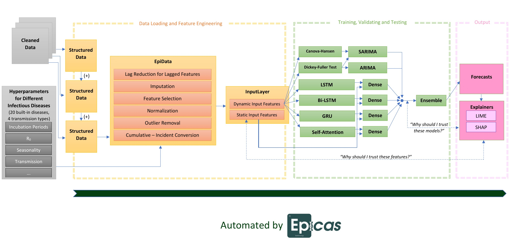

<p align="center">

</p>

**Epicas** stands for **Epi**demiological Fore**cas**ting. Epicas is an AutoML framework based on TensorFlow and statsmodels.

## Pipeline: What Can It Do?

<p align="center">

</p>

Epicas automates data loading, merging, feature engineering, model building, training, validating, testing, hyperparameter finding, predicting, and explaining.

*tl;dr* It does all kinds of stuffs but data cleaning.

## Inspiration: Why Epicas?

"Large delays in the timing of epidemic peaks and
the prevention of epidemics in a large number of locations
could be achieved with the most extreme interventions, **but
only when they were made sufficiently early.**"[[1]](#1)

The main goal for epidemiological forecasting is to predict when and where the
disease outbreaks will happen. However, these predictions only matter if they
are made **early and trustworthy enough** for extreme interventions to be
made.

The achievement of most AutoML frameworks is their ability to make machine
learning more accessible to everyone. Keeping these use cases in mind, we tailored
Epicas not only for everyone, but also specifically for the professionals who
need it the most.

The status quo:

1. Public health officials, epidemiologists are those who have early access to
gold-standard data yet may feel uncomfortable building machine learning pipelines.

2. ML engineers, data scientists, scholars are the ones who usually join forecasting
on a voluntary basis, thus having late access to good data and needing to get a
model pipeline built quickly for fine-tuning.

## Installation

Epicas is only compatible to Python 3.7 or later.

It can be installed via the Python Package Index (PyPI).

```
pip install epicas
```

## Basic Usage

#### Data Loading
```
jhu = epicas.StructuredData(
      'demo/datasets/covid.xz',
      location = 'FIPS',
      date = 'date',
      incidence = 'confirmed_cases',
      )

population = epicas.StructuredData(
            'demo/datasets/Reichlab_Population.csv',
            location = 'location',
            usecols = ['location', 'population']
            )

mobility = epicas.StructuredData(
          'demo/datasets/mobility.csv.gz',
          location = 'FIPS',
          date = 'date'
          )

merged = jhu + population + mobility
```

#### Feature Engineering

```
merged = epicas.EpiData(merged, y='incidence', disease='covid19').imputation().target_to_ma(window=3)

merged = merged.lag_reduction(subset=['fb_movement_change', 'fb_stationary'], sliding_window=21)

```

#### Model Selecting and Forecasting

```
forecasts = epicas.Ensemble(merged, ['attention', 'ARIMA'], '2021-09-01').get_predict()
```

This framework is being documented. At the moment, please read examples from [Jupyter notebooks.](https://github.com/caominhduy/epicas/docs/ipynb)


## Development

Epicas is still under development, yet most basic usage is already functional (0.1.0).

- [x] StructuredData (data loading and merging)
- [x] EpiData (feature engineering)
- [x] ARIMA
- [ ] Seasonal ARIMA
- [x] LSTM
- [x] Bidirectional LSTM
- [x] GRU
- [x] Self-attention based + BiLSTM
- [x] Unweighted Average Ensemble
- [ ] Weighted Average Ensemble
- [ ] LIME/SHAP (blackbox model explainers)
- [ ] RNN Hyperparameter Selecting

## References
<a id="1">[1]</a>
Cooper BS, Pitman RJ,
Edmunds WJ, Gay NJ (2006)
Delaying the international spread of pandemic influenza.
PLoS Med 3(6): e212.
DOI: 10.1371/journal.pmed.0030212
